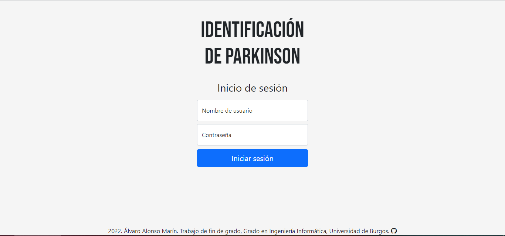
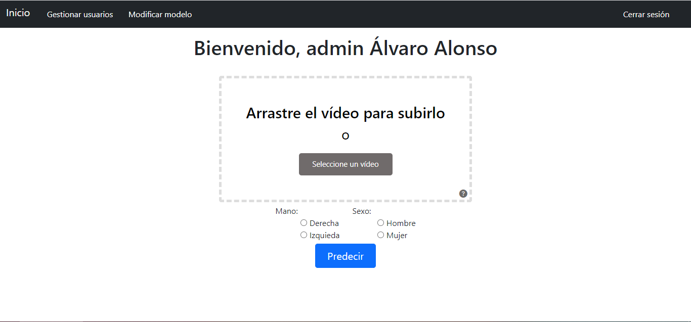
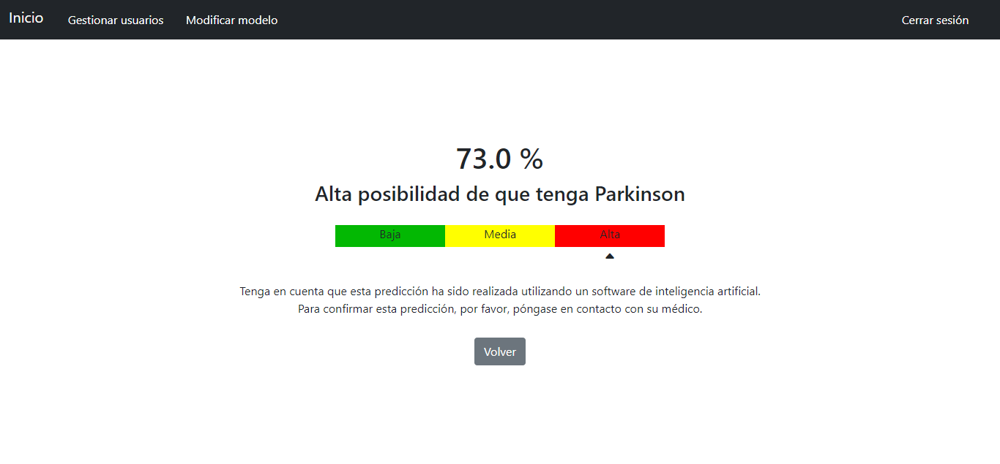

# TFG_Deteccion_Parkinson

**Identificación de Parkinson mediante visión artificial**

Trabajo de Fin de Grado del Grado en Ingeniería Informática de la Universidad de Burgos

**Alumno:** Álvaro Alonso Marín

**Tutores:** Álvar Arnaiz González y Alicia Olivares Gil

---

### Resumen:
La enfermedad del Parkinson es la enfermedad neurodegenerativa más común del mundo después del Alzheimer. Por esta razón, se ha pretendido durante años ayudar a aquellos que padezcan la enfermedad. Son millones de personas las que sufren esta enfermedad, la cual dificulta su día a día.
			
Debido a ello, en este proyecto se busca contribuir al tratamiento de la enfermedad, realizando una investigación utilizando técnicas de minería de datos que faciliten su identificación. Mediante un movimiento con la mano, se pueden extraer características que identifiquen el Parkinson, y así, poder realizar entrenamientos y predicciones con los modelos de inteligencia artificial.
			
Además, se ha desarrollado una aplicación web capaz de procesar un vídeo de una mano para conocer cuánta probabilidad hay de que esa persona padezca Parkinson.

### Abstract:
Parkinson's disease is the most common neurodegenerative disease in the world after Alzheimer. For this reason, it has been wanted for years to help people with this disease. Millions of people suffer this disease, that difficults their daily life.
			
Because of this, this project soughts to contribute to the treatment of the disease, doing a investigation using data mining techniques to make its identification easier. With a hand movement, it is possible to extract features that can identify Parkinson's disease, with the goal of doing trainings and predictions with the artificial intelligence models.
			
Besides, a web application has been developed. It is able to processing a video of a hand to know the probability of that person endures Parkinson's disease.

---
### Aplicación web:
Para instalar la aplicación web y arrancarla en local, se puede descargar la última versión de la *release*.

Para acceder a la aplicación web mediante conexión a Internet, se puede acceder mediante el siguiente enlace: http://tfg.identificacionparkinson.es:5000

